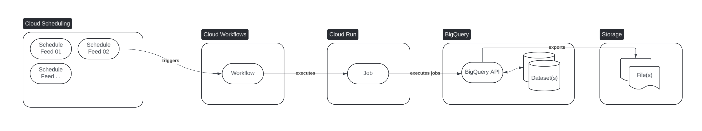

# Releasing data feeds on Google Cloud Platform

## Data feed

A data feed is an asset consumers (users) can subscribe to.
For us, data feeds are files representing a specific dataset (like daily sale records or updated client profiles).


## How it will work

We are working with Google Cloud, and we assume all the feed content can be retrieved using a single BigQuery SQL statement.
We will leverage the BigQuery API to create a temporary table representing the queried dataset, and then exporting this dataset to a bucket in Google Cloud Storage


## Trigger

The Cloud Run Job will be managed by a Cloud Workflow allowing to add previous and following steps to its execution. Cloud Workflows also allows different trigger methods (Scheduler, Event Arc.).
The Workflow will be triggered by Cloud Scheduler (Cron).


## Core concepts
### Input parameters
The feed generator module allows to generate several data feeds (as described) in several environments. Environment and Feed (instance) parameters are different: the same feeds parameters will be used cross environment
#### Environment parameters
Environment parameters will be managed in the Terraform execution pipeline (in `.tfvars` files).
- Environment name
- Source, execution and destination Google Cloud Projects / buckets
#### Feed parameter
Feed parameters will be managed in the Terraform code itself (versioned). We call the feed parameters: configs.
- Feed name
- SQL query
- Destination file name
- Schedule

### Software components
Using and deploying this software requires to understand how it works and its components.
#### The task (Cloud Run Job)
The task is a dockerized Python script. It will be executed by the Cloud Run Job component and will manage the different jobs sent to BigQuery as well as the runtime rendering of some parameters (adding current date in the file name or in the query).

It uses a famous Python templating framework: Jinja2.

The task is a simple Python script. We assume the script is part of a continues integration pipeline triggering the build and the publication of the image to a registry. The same image will be used cross environment (version can eventually differ).

The task code can be found in the `job` directory.

#### The infrastructure
In the `gcloud` directory, you can find different assets:
- The `configs` directory hosts all the feed configurations (one configuration = one feed)
- The `sql` directory hosts all the SQL queries related to the feeds. One SQL query can belong to several feeds. The SQL query can contain *template parameters* and the config can render the SQL query with its own parameter set.
- The root terraform code (`main.tf`) describes the cloud resources needed to create the feed generator (destination bucket, service account), the different permissions needed, as well as the description of the feeds (configurations) the feed generator will manage. Each new feed will have to be added to this code.
- The `modules/exporter` Terraform module will manage the global resources (cross feeds) such as the staging dataset used to store the temporary BigQuery results, the Cloud Run Job instance or the Cloud Workflows instance
- The `modules/schedules_export` Terraform module will manage each feed dedicated resource: the Cloud Scheduler with the feed dedicated parameters (SQL query, destination filename, etc.)

### Dynamic code rendering
The produced code manages different rendering methods, used at different moments in the software cycle and ingesting different parameters. It is crucial to understand the different abstractions to develop on this codebase.

#### Deployment based rendering
During the continuous deployment pipeline, all the environment parameters will be ingested to the Terraform code.
The input will be a `.tfvars` file or a set of parameters in the `terraform plan` command. This parameters will be fixed until the next deployment. Each deployment will own its own set of parameters.

We can distinguish deployment based rendering with the `${variable}` notation (Terraform).

There can be deployment based ingestion at different component levels:
- In the image build
- In the main terraform code `main.tf`
- In the `modules/schedules_export` module, for each feed

#### Runtime based rendering
Some parameters will be integrated when each feed will be generated. We use this feature to format and display changing parameters, such as dates or times. These parameters are mainly used by the Python code, but the templates can be found in the `gcloud` directory.

We can distinguish the runtime based rendering with the `{{variable}}` notation (Jinja2).

## Global architecture



### Automation pipelines
#### Task image build

#### Cloud resources deployment


## How to

### Build the task image

The image can be build using the following code
```bash
cd job
gcloud builds submit . \
    --region preferred-region \
    --tag us.gcr.io/your-project-id/image-name \
    --project your-project-id
```
This command will build and host the image on Google Cloud Artifact Registry.

### Execute the task locally

To use this script, we need a Google Cloud Project with the billing already enables, as well as the BigQuery and Storage API, a bucket used as destination and a dataset in BigQuery used to store staging results.

The task can be executed by using the built image or by directly using the Python script 

First, we need to setup the Python virtual environment:
```bash
cd job

virtualenv venv
source venv/bin/activate

pip install -r requirements.txt
```

Then, we can use the task:
```bash
BIGQUERY_JOB_EXECUTING_PROJECT=project_name BIGQUERY_STAGING_DATASET=dataset_name python main.py \
    --sql 'select 1 as one' \
    --destination-uri gs://bucket-name/filename.csv.gz
```

Or with docker
```bash
docker run --rm -it \
    -e BIGQUERY_JOB_EXECUTING_PROJECT=project_name \
    -e BIGQUERY_STAGING_DATASET=dataset_name \
    -v $HOME/.config/gcloud:/root/.config/gcloud \
    aeud/bqflat \
    --sql 'select 1 as one' \
    --destination-uri gs://bucket-name/filename.csv.gz
```
*We share the `gcloud` credentials by sharing the volume*

**More documentation about the task [here](./job/README.md)**

### Deploy the cloud infrastructure (from a local machine)

First, we need to initiate the Terraform repository
```bash
cd gcloud
terraform init
```

We also need to create the `.tfvars` file to store all the *environment varables*. Let's call it `env.auto.tfvars`.

```bash
echo 'project_id = "project-id"
project_region = "region"
bq_flat_filer_image = "us.gcr.io/your-project-id/image-name"

cloud_run_instance_name = "bq-flatfiler"
cloud_workflow_name = "bq-flatfiler"
service_account_name = "bq-flatfiler"
staging_dataset_name = "demo_bqflat_stg"
staging_dataset_location = "US"

destination_bucket_name = "bucket-name"
destination_bucket_location = "US"

env_vars = {
    source_project_id = "bigquery-public-data"
}' > env.auto.tfvars
```

Finally, we can plan and apply the terraform code.
```bash
terraform plan --out plan.tf
terraform apply plan.tf
```

### Add a new feed

To add a new feed, we must:
1. Add a new SQL query in the `gcloud/sql` directory (optional).
2. Add a new config file in the `gcloud/configs` directory.
3. Update the `main.tf` code to add the new created config.
4. Release the new Terraform code and execute the deployment pipeline.

### Remove a feed

To remove a feed, we must:
1. Remove the feed config from the `main.tf` code.
2. Release the new Terraform code and execute the deployment pipeline.

### Grant (or revoke) access to a feed

Feeds are file hosted on Google Cloud Storage. We can inherit from the Cloud Storage IAM strategy.
In our case, the bucket is setup in a uniform mode, so we can give access to the bucket, but not to specific (only) files.
We can extend the `main.tf` code to refer to consumers, service accounts or groups.
Any other IAM compatible strategy will also work (Cloud console, link to the Active Directory, etc.).

## Limitations
- The task only exports the files to Cloud Storage, in CSV, with a "," (comma) separator and compressed (GZIP).
- All the [inherited limitations of the export feature from BigQuery](https://cloud.google.com/bigquery/docs/exporting-data#export_limitations).
- Access management inherited from the uniform bucket.

## Backlog
- Parameters to export in JSON
- Parameters to change the separator for CSV exports